# SYSTEM DIAGRAMS AND DOCUMENTATION
## Mango Disease Detection System (Scan2Save)

---

## 1. SYSTEM FLOWCHARTS

### 1.1 Main System Flowchart

```mermaid
flowchart TD
    Start([User Opens Application]) --> CheckAuth{Is User<br/>Authenticated?}
    
    CheckAuth -->|No| Landing[Display Landing Page]
    Landing --> AuthChoice{User Action?}
    AuthChoice -->|Sign Up| SignUp[Sign Up Form]
    AuthChoice -->|Sign In| SignIn[Sign In Form]
    
    SignUp --> ValidateSignUp{Valid<br/>Credentials?}
    ValidateSignUp -->|No| SignUpError[Show Error Message]
    SignUpError --> SignUp
    ValidateSignUp -->|Yes| CreateUser[Create User Account<br/>in Supabase]
    CreateUser --> CreateProfile[Create User Profile<br/>in Database]
    CreateProfile --> Dashboard
    
    SignIn --> ValidateSignIn{Valid<br/>Credentials?}
    ValidateSignIn -->|No| SignInError[Show Error Message]
    SignInError --> SignIn
    ValidateSignIn -->|Yes| LoadSession[Load User Session]
    LoadSession --> Dashboard
    
    CheckAuth -->|Yes| Dashboard[Display Dashboard]
    Dashboard --> MainMenu{User<br/>Selection?}
    
    MainMenu -->|Scan| ScanPage[Navigate to Scan Page]
    MainMenu -->|History| HistoryPage[Navigate to History Page]
    MainMenu -->|Profile| ProfilePage[Navigate to Profile Page]
    MainMenu -->|Logout| Logout[Sign Out]
    Logout --> Landing
    
    ScanPage --> ScanChoice{Image Source?}
    ScanChoice -->|Camera| CaptureImage[Open Camera<br/>Capture Image]
    ScanChoice -->|Upload| UploadImage[Open File Picker<br/>Select Image]
    
    CaptureImage --> ValidateImage{Valid Image?}
    UploadImage --> ValidateImage
    ValidateImage -->|No| ImageError[Show Error<br/>Invalid Format/Size]
    ImageError --> ScanPage
    
    ValidateImage -->|Yes| PreviewImage[Display Image Preview]
    PreviewImage --> StartAnalysis[User Clicks Analyze]
    StartAnalysis --> ProcessImage[Convert to Base64<br/>Resize to 640x640]
    ProcessImage --> LoadModel{YOLO Model<br/>Loaded?}
    
    LoadModel -->|No| LoadYOLO[Load YOLOv8s Model<br/>yolov8s.pt]
    LoadYOLO --> LoadModel
    LoadModel -->|Yes| RunInference[Run AI Inference<br/>Detect Diseases]
    
    RunInference --> DetectObjects[Detect Objects<br/>Apply NMS Filter<br/>Confidence > 50%]
    DetectObjects --> CountDetections{Number of<br/>Detections?}
    
    CountDetections -->|1-3| ClassifyAll[Classify All Detections<br/>Die Back/Healthy/Powder Mildew]
    CountDetections -->|0| NoDetection[No Disease Detected<br/>Show Error]
    NoDetection --> ScanPage
    
    ClassifyAll --> MapDisease[Map to Disease Database<br/>Get Symptoms & Treatments]
    MapDisease --> SaveMultiple[Save All Detections<br/>to Database<br/>Separate Records]
    
    SaveMultiple --> UpdateStats[Update User Statistics<br/>Increment Total Scans]
    UpdateStats --> ResultsPage[Display Results Page]
    
    ResultsPage --> ShowPrimary[Show Primary Detection<br/>Highest Confidence]
    ShowPrimary --> ShowAll[Show All Detections Grid<br/>1-3 Diseases]
    ShowAll --> ShowDetails[Show Symptoms<br/>Treatments<br/>Prevention]
    ShowDetails --> ResultAction{User Action?}
    
    ResultAction -->|Download| GeneratePDF[Generate PDF Report]
    GeneratePDF --> ResultsPage
    ResultAction -->|New Scan| ScanPage
    ResultAction -->|View History| HistoryPage
    
    HistoryPage --> LoadHistory[Load All Scans<br/>Group by Session]
    LoadHistory --> FilterHistory{Apply Filter?}
    FilterHistory -->|All| ShowAll2[Display All Scans]
    FilterHistory -->|Healthy| ShowHealthy[Display Healthy Only]
    FilterHistory -->|Diseased| ShowDiseased[Display Diseased Only]
    
    ShowAll2 --> SelectScan{User Selects<br/>Scan?}
    ShowHealthy --> SelectScan
    ShowDiseased --> SelectScan
    
    SelectScan -->|Yes| ViewResult[View Scan Details]
    ViewResult --> ResultsPage
    SelectScan -->|Delete| ConfirmDelete{Confirm<br/>Delete?}
    ConfirmDelete -->|Yes| DeleteAll[Delete All Related<br/>Detection Records]
    DeleteAll --> HistoryPage
    ConfirmDelete -->|No| HistoryPage
    SelectScan -->|Back| MainMenu
    
    ProfilePage --> ShowProfile[Display User Info<br/>Statistics<br/>Settings]
    ShowProfile --> ProfileAction{User Action?}
    ProfileAction -->|Edit Profile| EditProfile[Update Name/Avatar]
    EditProfile --> SaveProfile[Save to Database]
    SaveProfile --> ProfilePage
    ProfileAction -->|Change Language| ChangeLanguage[Toggle EN/TL]
    ChangeLanguage --> ProfilePage
    ProfileAction -->|Back| MainMenu
    
    style Start fill:#4CAF50
    style Dashboard fill:#2196F3
    style RunInference fill:#FF9800
    style SaveMultiple fill:#9C27B0
    style ResultsPage fill:#4CAF50
```

---

### 1.2 Authentication Flowchart

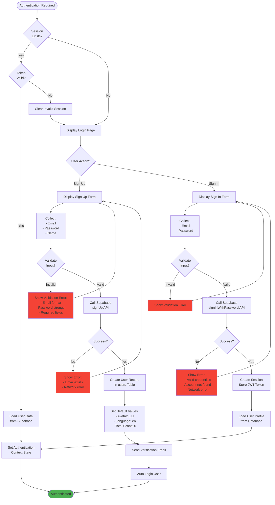

---

### 1.3 Disease Detection Flowchart (Detailed)

```mermaid
flowchart TD
    Start([Image Uploaded/Captured]) --> ValidateFile{Validate File}
    
    ValidateFile -->|Invalid Type| ErrorType[Error: Invalid File Type<br/>Accept: JPEG, PNG, WebP]
    ErrorType --> End1([Return to Scan Page])
    
    ValidateFile -->|Too Large| ErrorSize[Error: File Too Large<br/>Max: 10MB]
    ErrorSize --> End1
    
    ValidateFile -->|Valid| ConvertBase64[Convert Image<br/>to Base64 String]
    ConvertBase64 --> ShowPreview[Display Image Preview<br/>Show Analyze Button]
    
    ShowPreview --> UserAnalyze{User Clicks<br/>Analyze}
    UserAnalyze -->|Cancel| ResetImage[Clear Image<br/>Reset State]
    ResetImage --> End1
    
    UserAnalyze -->|Analyze| StartProgress[Show Progress Bar<br/>0%]
    StartProgress --> CheckModel{Model<br/>Loaded?}
    
    CheckModel -->|No| InitModel[Initialize YOLOv8 Model]
    InitModel --> LoadWeights[Load Model Weights<br/>yolov8s.pt]
    LoadWeights --> SetConfig[Set Config:<br/>- Input: 640x640<br/>- Conf Threshold: 0.5<br/>- IoU Threshold: 0.45]
    SetConfig --> Progress25[Update Progress: 25%]
    Progress25 --> CheckModel
    
    CheckModel -->|Yes| PreprocessImage[Preprocess Image:<br/>1. Resize to 640x640<br/>2. Normalize pixels<br/>3. Convert to tensor]
    PreprocessImage --> Progress50[Update Progress: 50%]
    
    Progress50 --> RunModel[Run YOLO Inference<br/>Forward Pass]
    RunModel --> GetPredictions[Get Raw Predictions:<br/>- Bounding boxes<br/>- Class probabilities<br/>- Confidence scores]
    GetPredictions --> Progress75[Update Progress: 75%]
    
    Progress75 --> ApplyNMS[Apply Non-Max Suppression<br/>Remove Overlapping Boxes<br/>IoU < 0.45]
    ApplyNMS --> FilterConfidence[Filter Detections<br/>Confidence > 50%]
    
    FilterConfidence --> CountResults{Number of<br/>Detections?}
    
    CountResults -->|0| NoDetection[No Disease Detected]
    NoDetection --> ShowNoDetectionError[Show Error Message:<br/>Try different image]
    ShowNoDetectionError --> End1
    
    CountResults -->|1-3| SortByConfidence[Sort Detections<br/>By Confidence Descending]
    CountResults -->|> 3| LimitDetections[Keep Top 3<br/>Highest Confidence]
    LimitDetections --> SortByConfidence
    
    SortByConfidence --> MapClasses[Map Class Indices:<br/>0 → Die Back<br/>1 → Healthy<br/>2 → Powder Mildew]
    
    MapClasses --> GetDiseaseInfo[Get Disease Info<br/>from Database:<br/>- Symptoms<br/>- Treatments<br/>- Prevention<br/>- Description]
    
    GetDiseaseInfo --> CreateRecords[Create Detection Objects:<br/>For Each Detection:<br/>- Disease ID<br/>- Disease Name<br/>- Confidence %<br/>- Severity<br/>- Bbox Coordinates]
    
    CreateRecords --> Progress90[Update Progress: 90%]
    Progress90 --> SaveToDB[Save to Database]
    
    SaveToDB --> Loop1{For Each<br/>Detection}
    Loop1 -->|Next| InsertRecord[Insert Scan Record:<br/>- user_id<br/>- disease_id<br/>- disease_name<br/>- confidence<br/>- severity<br/>- image_url (Base64)<br/>- location<br/>- model metadata]
    InsertRecord --> Loop1
    
    Loop1 -->|Done| UpdateUserStats[Update User Record:<br/>Increment total_scans]
    UpdateUserStats --> Progress100[Update Progress: 100%]
    
    Progress100 --> PrepareResults[Prepare Results Object:<br/>- Primary Detection<br/>- All Detections Array<br/>- Scan IDs Array<br/>- Model Metadata]
    
    PrepareResults --> NavigateResults[Navigate to<br/>Results Page]
    NavigateResults --> End2([Show Results])
    
    style Start fill:#4CAF50
    style RunModel fill:#FF9800
    style SaveToDB fill:#9C27B0
    style End2 fill:#4CAF50
    style ErrorType fill:#F44336
    style ErrorSize fill:#F44336
    style NoDetection fill:#FF9800
```

---

### 1.4 Database Operations Flowchart

```mermaid
flowchart TD
    Start([Database Operation]) --> OpType{Operation<br/>Type?}
    
    OpType -->|Save Scan| SaveStart[Receive Scan Data]
    SaveStart --> CheckDetections{Multiple<br/>Detections?}
    
    CheckDetections -->|No| CreateSingle[Create Single<br/>Scan Record]
    CreateSingle --> InsertSingle[INSERT INTO scans<br/>VALUES ...]
    InsertSingle --> TriggerCount1[Trigger: update_user_total_scans<br/>Increment by 1]
    TriggerCount1 --> ReturnSingle[Return Scan ID]
    ReturnSingle --> End1([Success])
    
    CheckDetections -->|Yes| CreateMultiple[Create Multiple<br/>Scan Records]
    CreateMultiple --> LoopInsert{For Each<br/>Detection}
    
    LoopInsert -->|Next| InsertOne[INSERT INTO scans<br/>Same image_url<br/>Same user_id<br/>Different disease_id<br/>Different confidence]
    InsertOne --> LoopInsert
    
    LoopInsert -->|Done| TriggerCountMulti[Trigger Fires N times<br/>Increment total_scans by N]
    TriggerCountMulti --> ReturnMultiple[Return Array of Scan IDs]
    ReturnMultiple --> End1
    
    OpType -->|Load History| LoadStart[Receive User ID]
    LoadStart --> QueryScans[SELECT * FROM scans<br/>WHERE user_id = ?<br/>ORDER BY analyzed_at DESC]
    QueryScans --> GroupScans[Group By:<br/>image_url + timestamp<br/>Within 1 second]
    
    GroupScans --> LoopGroups{For Each<br/>Group}
    LoopGroups -->|Next| SortGroup[Sort Group By<br/>Confidence DESC]
    SortGroup --> SetPrimary[First = Primary Detection]
    SetPrimary --> CreateScanObject[Create Scan Object:<br/>- Primary data<br/>- allDetections array<br/>- scanIds array]
    CreateScanObject --> LoopGroups
    
    LoopGroups -->|Done| SortByDate[Sort All Scans<br/>By Date DESC]
    SortByDate --> ReturnHistory[Return Scan History Array]
    ReturnHistory --> End1
    
    OpType -->|Delete Scan| DeleteStart[Receive Scan ID]
    DeleteStart --> FindScan[Find Scan in History]
    FindScan --> HasScanIds{Has scanIds<br/>Array?}
    
    HasScanIds -->|Yes| LoopDelete{For Each<br/>Scan ID}
    LoopDelete -->|Next| DeleteOne[DELETE FROM scans<br/>WHERE id = ?]
    DeleteOne --> TriggerDelete1[Trigger: update_user_total_scans<br/>Decrement by 1]
    TriggerDelete1 --> LoopDelete
    LoopDelete -->|Done| End1
    
    HasScanIds -->|No| DeleteSingle[DELETE FROM scans<br/>WHERE id = ?]
    DeleteSingle --> TriggerDeleteSingle[Trigger: update_user_total_scans<br/>Decrement by 1]
    TriggerDeleteSingle --> End1
    
    OpType -->|Update Profile| UpdateStart[Receive User ID<br/>+ Update Data]
    UpdateStart --> ValidateUpdate{Valid<br/>Fields?}
    ValidateUpdate -->|No| ErrorUpdate[Return Error]
    ErrorUpdate --> End2([Error])
    
    ValidateUpdate -->|Yes| UpdateRecord[UPDATE users<br/>SET name=?, avatar=?<br/>WHERE id = ?]
    UpdateRecord --> TriggerUpdate[Trigger: update_updated_at<br/>Set updated_at = NOW()]
    TriggerUpdate --> ReturnUpdated[Return Updated User]
    ReturnUpdated --> End1
    
    OpType -->|Get Disease Info| DiseaseStart[Receive Disease ID]
    DiseaseStart --> QueryDisease[SELECT * FROM diseases<br/>WHERE id = ?]
    QueryDisease --> CheckExists{Disease<br/>Exists?}
    CheckExists -->|No| ErrorNotFound[Return 404 Error]
    ErrorNotFound --> End2
    
    CheckExists -->|Yes| ReturnDisease[Return Disease Object:<br/>- Symptoms array<br/>- Treatments array<br/>- Prevention text<br/>- Description]
    ReturnDisease --> End1
    
    style End1 fill:#4CAF50
    style End2 fill:#F44336
    style TriggerCount1 fill:#FF9800
    style TriggerCountMulti fill:#FF9800
    style TriggerDelete1 fill:#FF9800
```

---

## 2. USE CASE DIAGRAM

```mermaid
graph TB
    subgraph "Mango Disease Detection System"
        subgraph "User Management"
            UC1[Register Account]
            UC2[Login]
            UC3[Logout]
            UC4[Update Profile]
            UC5[Change Language]
        end
        
        subgraph "Disease Detection"
            UC6[Capture Image]
            UC7[Upload Image]
            UC8[Analyze Image]
            UC9[View Detection Results]
            UC10[View Multiple Detections]
        end
        
        subgraph "Scan Management"
            UC11[View Scan History]
            UC12[Filter Scans]
            UC13[View Scan Details]
            UC14[Delete Scan]
            UC15[Download Report]
        end
        
        subgraph "Information Access"
            UC16[View Disease Information]
            UC17[View Symptoms]
            UC18[View Treatments]
            UC19[View Prevention Tips]
        end
        
        subgraph "Statistics"
            UC20[View Scan Statistics]
            UC21[View Health Rate]
        end
    end
    
    User([👤 Farmer/User])
    Admin([👨‍💼 Admin])
    YOLOModel([🤖 YOLO Model])
    Database([💾 Database])
    AuthSystem([🔐 Auth System])
    
    User --> UC1
    User --> UC2
    User --> UC3
    User --> UC4
    User --> UC5
    User --> UC6
    User --> UC7
    User --> UC8
    User --> UC9
    User --> UC10
    User --> UC11
    User --> UC12
    User --> UC13
    User --> UC14
    User --> UC15
    User --> UC16
    User --> UC17
    User --> UC18
    User --> UC19
    User --> UC20
    User --> UC21
    
    Admin --> UC1
    Admin --> UC2
    Admin --> UC11
    Admin --> UC20
    
    UC1 --> AuthSystem
    UC2 --> AuthSystem
    UC3 --> AuthSystem
    
    UC4 --> Database
    UC5 --> Database
    
    UC8 --> YOLOModel
    UC8 --> Database
    UC9 --> Database
    UC10 --> Database
    
    UC11 --> Database
    UC12 --> Database
    UC13 --> Database
    UC14 --> Database
    
    UC16 --> Database
    UC17 --> Database
    UC18 --> Database
    UC19 --> Database
    
    UC20 --> Database
    UC21 --> Database
    
    style User fill:#4CAF50
    style Admin fill:#2196F3
    style YOLOModel fill:#FF9800
    style Database fill:#9C27B0
    style AuthSystem fill:#F44336
```

---

## 3. DATA FLOW DIAGRAMS (DFD)

### 3.1 Context Diagram (Level 0)

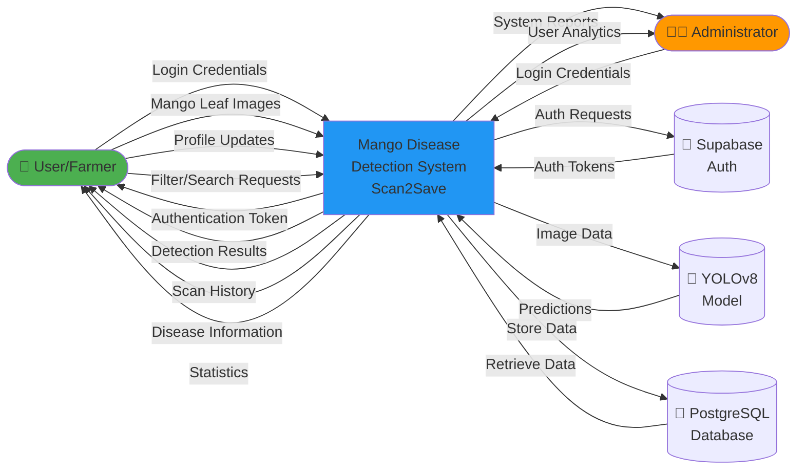

---

### 3.2 Level 1 DFD - Major Processes

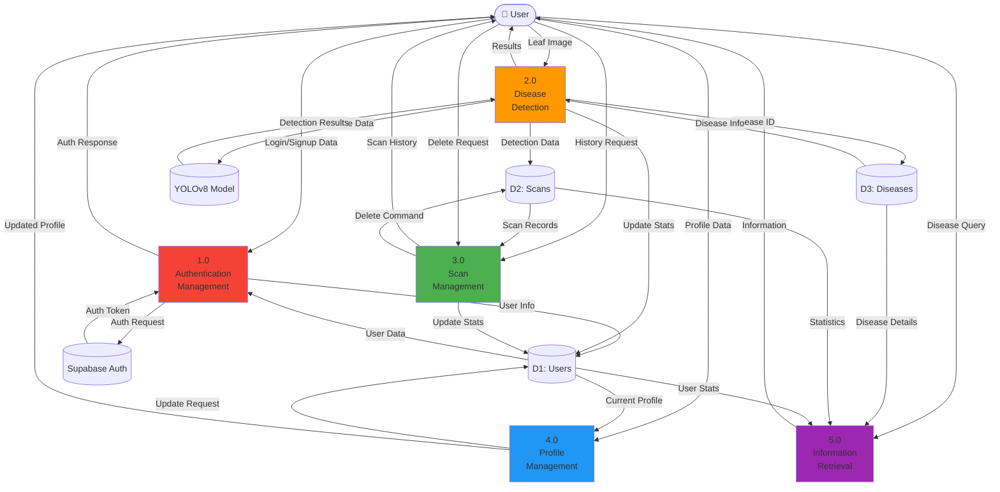

---

### 3.3 Level 2 DFD - Disease Detection Process (Process 2.0)

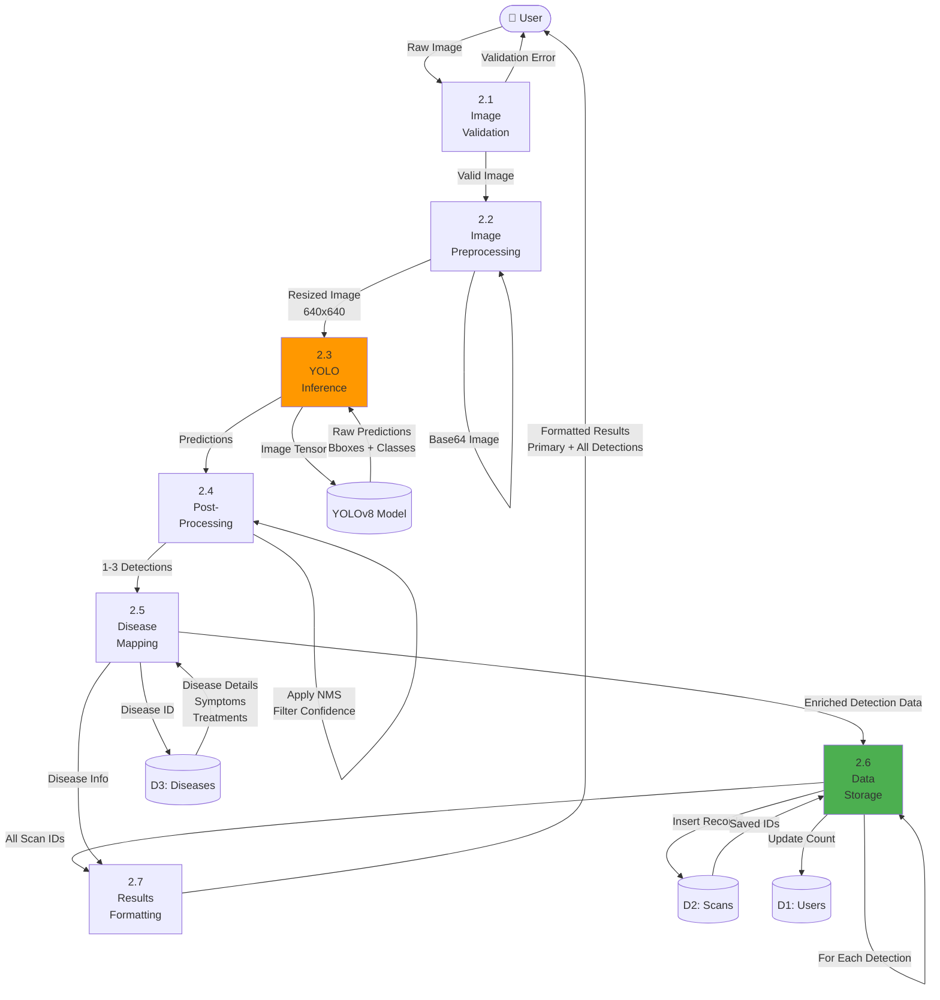

---

### 3.4 Level 2 DFD - Scan Management Process (Process 3.0)

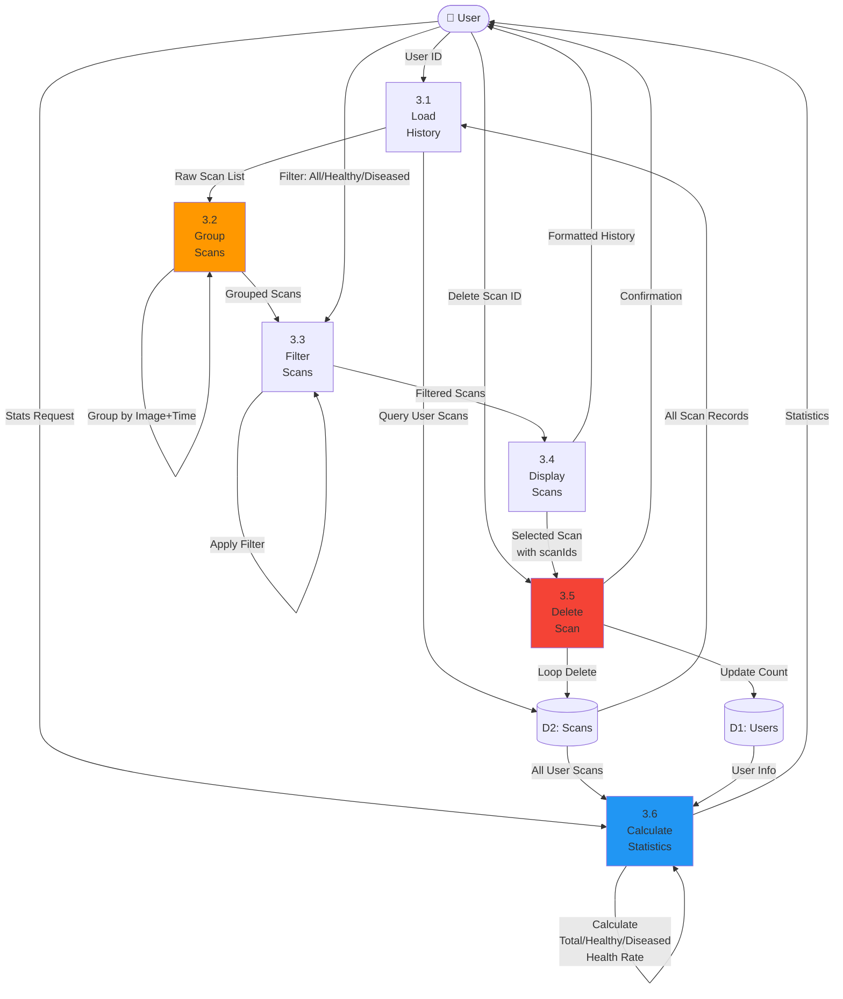

---

## 4. ENTITY RELATIONSHIP DIAGRAM (ERD)

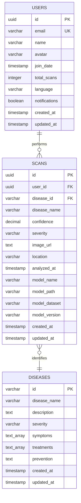

**Cardinality:**
- One USER can have MANY SCANS (1:N)
- One SCAN identifies ONE DISEASE (N:1)
- One DISEASE can be identified in MANY SCANS (1:N)

**Relationships:**
1. **USERS ↔ SCANS**: One-to-Many
   - A user can perform multiple scans
   - Each scan belongs to exactly one user
   - Cascade delete: When user is deleted, all their scans are deleted

2. **SCANS ↔ DISEASES**: Many-to-One
   - Multiple scans can identify the same disease
   - Each scan record identifies exactly one disease
   - For multi-detection scans, multiple scan records are created
   - Each scan record shares the same image_url but different disease_id

---

## 5. SYSTEM ARCHITECTURE DIAGRAM

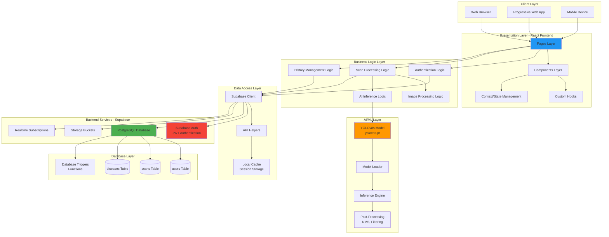

---

## 6. SEQUENCE DIAGRAMS

### 6.1 User Registration Sequence

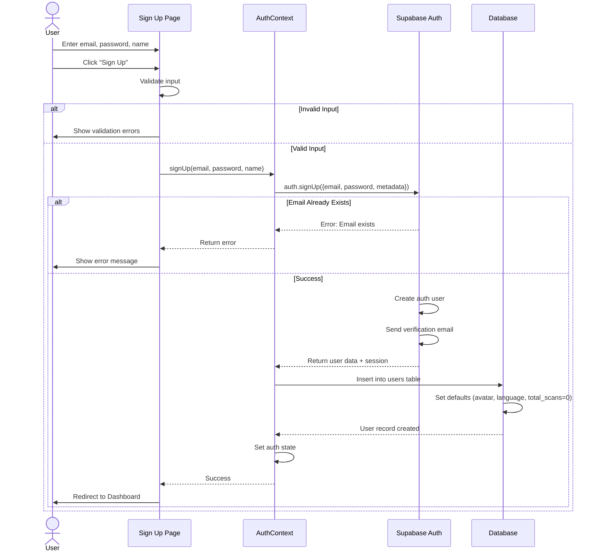

---

### 6.2 Disease Detection Sequence

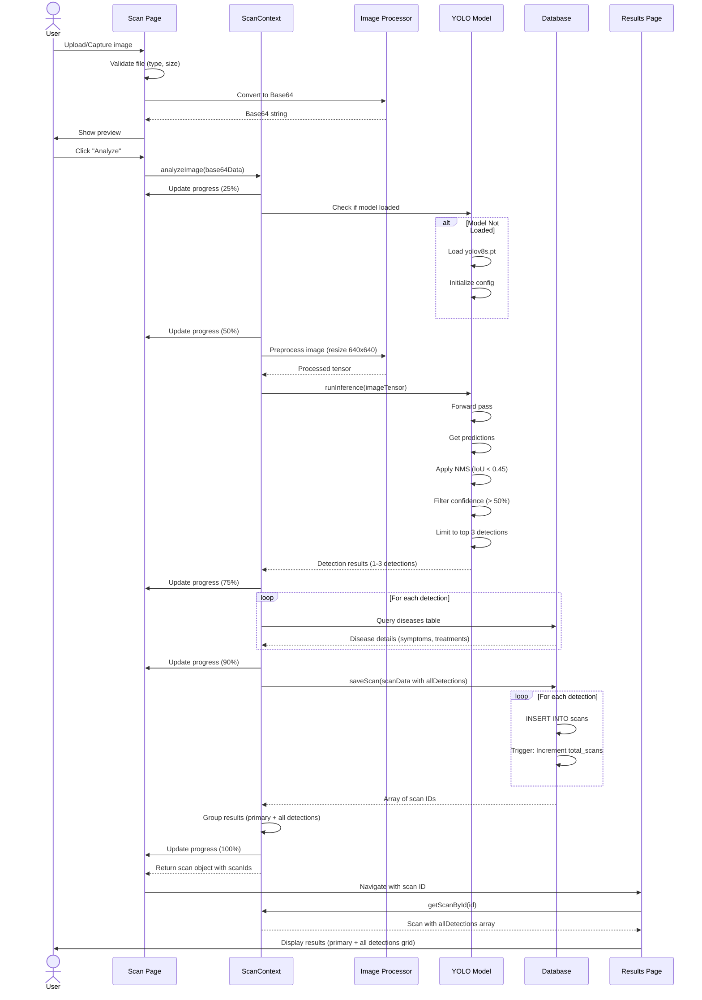

---

### 6.3 Load Scan History Sequence

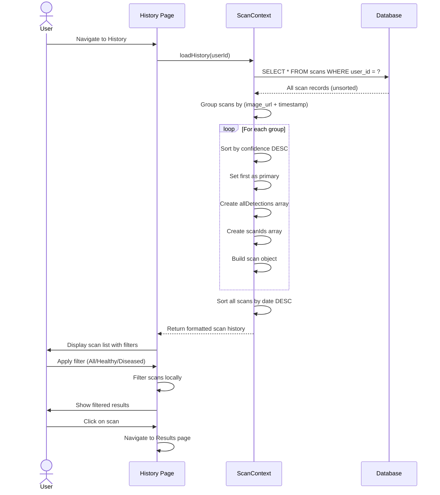

---

**Document Version:** 1.0  
**Last Updated:** November 20, 2025  
**Created By:** System Analysis Team
